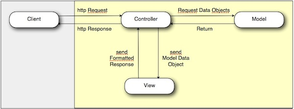

# HMVC

We touched on HMVC earlier within the concepts document, however we will go into a little more detail here.

###What's wrong with MVC?

The problem with MVC (in stateless applications) on its own is that it is often considered a very much one shot execution type deal. You make a request to the web server, some handler intercepts the request, works out what controller to load, executes some action on the controller that gets data from the model, sends model data object the view, renders the view and returns the response to the browser.

Though MVC comes in different flavours, control flow is generally as follows:

1. The user interacts with the user interface in some way (for example, presses a mouse button).
2. An HTTP request is sent from the browser to the server.
3. The controller handles the input event from the user interface, often via a registered handler or callback.
4. The controller notifies the model of the user action, possibly resulting in a change in the model's state. (for example, the controller updates the user's shopping cart)
5. A view uses the model indirectly to generate an appropriate user interface (for example, the view lists the shopping cart's contents). The view gets its own data from the model. The model and controller have no direct knowledge of the view.
6. The user interface waits for further user interactions, which restarts the cycle.

All fine and dandy. So what's wrong with the above model?

Well think about most web pages that you visit. Generally they're a collection of different modules or widgets on one page, a collection of different views all assembled in one. Sure, it is possible to achieve the same effect using just MVC, but you will most likely end up having to hack things around, write custom templates to load specific data into a specific view, or even worse get the data yourself and push it into another view, gross.

Take a product page for example. A product page may contain the following features:

* An image gallery
* A video
* Comments
* Related products
* Add to cart

Now in a typical MVC system, each of those parts is either custom coded into the product template, or dynamically included somehow. The problem is, in most cases, the dynamic includes are just including a template file, and that template file goes away and gets the data in order to render itself. This leads to very coupled interfaces that are hard to re-use and more importantly, hard to test. What happens when you want to use the same comments form, including all its styling and functionality, in the new blog section you've just made? 

Imagine if each of those elements could be a self contained MVC triad, with its own control logic, data storage and presentation. They could then be shared amongst your application, and even between projects.

###Why is HMVC better?

HMVC focuses on the idea of modularising your MVC triads such that they can be re-used within any other MVC triad in a **"hierarchical"** fashion, hence HMVC.

The image on the left shows a single MVC triad, the image on the right shows a hierarchy of MVC triads, each dispatching a request to the controller of another triad.

This allows you to create complex systems out of pre-existing reusable, modular parts, or in Nooku's case, **components**. Each component can be tested on its own, can be built independently and concurrently at the same time as other components, and be re-usable. All this speeds up development and makes your code more structured, and stable. 

One of the other major concerns of HMVC is the control aspect. In most MVC implementations, the request for a sub view goes directly to the view, thus bypassing the controller, and any form of ACL that might be implemented. That is BAD! Requests for sub views should go through the controller, this way, all your control logic is loaded just as if the request had come in via HTTP, and everything is kept safe. Also, if your controller implements any form of command chain (as Nooku does) then you want those commands to be executed before/after the request as they may perform crucial manipulations of the input/output.

###How?

Hopefully now you can see the power of HMVC and want to start using it. Nooku implements HMVC out fo the box. In fact, it was designed to implement HMVC from the beginning, and uses it extensively throughout the admin interface.

Making an HMVC request is straightforward:

	echo KObjectManager::getInstance()->getObject('com://admin/component.controller.name')->render();

And if you need to set specific state information:

	echo KObjectManager::getInstance()->getObject('com://admin/component.controller.name')->render(array('id' => 5));

The above is essentially the same request that would happen as if it came directly from the browser via HTTP, as such, the controller is unaware it was requested internally. Pretty cool eh?